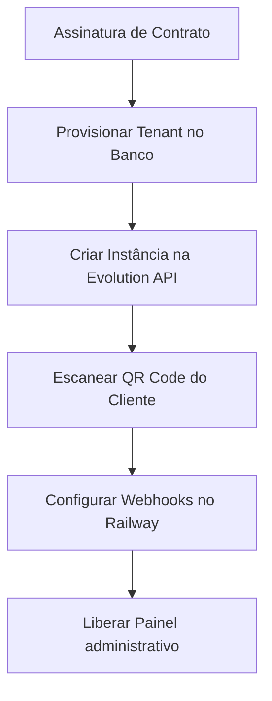

# Guia Completo de Vendas, Operação e Manual de Uso (SaaS WhatsApp)

Este documento foi criado para ajudar você (dono/vendedor) a compreender o funcionamento detalhado do sistema de ponta a ponta. Ele contém o manual passo a passo de como vender, configurar e operar a ferramenta para clínicas e lojas de personalizados.

---

## 1. O que é o Sistema? (Visão Geral)

Este é um **SaaS (Software as a Service) Multi-tenant** de gestão operacional e engajamento automatizado pelo WhatsApp. 

Diferente de robôs comuns de chat (chatbots simples), o nosso sistema é integrado ao banco de dados operacional. Ele atua de forma autônoma como um **atendente virtual** (recepcionista ou vendedor) inteligente, simulando comportamento humano.

### Os Dois Modos de Operação:
1. **Modo Clínica (Médica, Odontológica, etc.)**: Focado em agendar consultas, enviar confirmações de presença 48h antes, gerenciar lista de espera inteligente e reativar pacientes que não retornam há meses.
2. **Modo Loja (Personalizados, Comércio, etc.)**: Focado em guiar o cliente no processo de compra, aplicar preços dinâmicos por faixas de quantidade, registrar personalizações, gerar solicitações de aprovação para pedidos grandes e monitorar prazos de entrega.

---

## 2. Como Vender? (O Pitch de Vendas do ROI)

> [!TIP]
> **O segredo da venda**: Donos de negócios não querem comprar "mais um chatbot". Eles compram **lucro** e **redução de dor de cabeça**. 

Para vender este SaaS por **R$ 397,00 a R$ 997,00 por mês**, apresente a proposta focando na **Geração de ROI (Retorno sobre o Investimento)**:

### Pitch para Clínicas (Combate ao Absenteísmo):
- *"Doutor, se um paciente faltar amanhã, o senhor perdeu R$ 300,00. Se 10 faltarem no mês, são R$ 3.000,00 perdidos. Nosso sistema envia confirmações automáticas 48h antes. Se o paciente disser que vai faltar, o sistema busca na lista de espera o próximo da fila e preenche a vaga dele pelo WhatsApp em menos de 15 minutos de forma autônoma. O sistema se paga logo na primeira semana."*

### Pitch para Lojas (Automação de Pedidos e Retenção):
- *"Você perde horas todo dia explicando preços para clientes que querem 10, 50 ou 100 unidades? Nosso atendente virtual responde na hora, calcula a faixa de preço por atacado correta, coleta a personalização e salva tudo no painel. O seu cliente faz o pedido no WhatsApp em 2 minutos."*

---

## 3. Passo a Passo: Configurar um Novo Cliente (Tenant) do Zero

Para cadastrar uma nova empresa (Tenant) no sistema, o administrador realiza o seguinte processo técnico e administrativo:



### Passo 1: Provisionamento no Banco de Dados
Insira o novo cliente na tabela `tenants` e o usuário administrador (`dono`) no banco Supabase.
> Veja o [onboarding-checklist.md](file:///c:/Users/Felpopo/Documents/ProjetoSaas/docs/onboarding-checklist.md#L31-L89) para o script SQL pronto de criação.

### Passo 2: Conectar o WhatsApp (Evolution API)
Nós usamos a **Evolution API** para conectar a conta de WhatsApp do cliente ao sistema:
1. O backend envia uma requisição `POST /instance/create` para a Evolution API com um nome identificador único (ex: `clinica_sorriso`).
2. O sistema gera um **QR Code**.
3. O cliente abre o WhatsApp no celular, vai em **Aparelhos Conectados** > **Conectar um Aparelho** e escaneia esse QR Code.
4. Feito isso, o celular do cliente está pareado e o sistema começará a ler e responder às mensagens automaticamente.

---

## 4. Manual de Operação do Painel Administrativo (Frontend)

O painel é desenhado com foco em **Mobile-First** (ideal para uso em celulares e tablets rápidos). A seguir, veja como utilizar cada área:

### A. Dashboard (Visão do Dia)
- É a tela inicial. Ela exibe resumos de receitas geradas, consultas/pedidos agendados para hoje, percentual de confirmações e alertas de **Aprovações Pendentes**.
- **Atualização**: Os dados são recarregados dinamicamente a cada 30 segundos.

### B. Gestão de Clientes (CRM)
Para cadastrar ou buscar um cliente manualmente:
1. Acesse a aba **Pacientes** ou **Clientes** no menu lateral.
2. Clique em **Adicionar Novo**.
3. Insira o Nome Completo e o WhatsApp com DDI e DDD (ex: `5511999999999`).
4. **CRM de Reativação**: O sistema classifica os clientes em faixas: `Ativo`, `Inativo_3m` (3 meses sem ir), `Inativo_6m`, `Inativo_12m`. Toda segunda-feira o sistema envia mensagens específicas para trazer esses inativos de volta.

### C. Gestão de Serviços/Produtos e Faixas de Preço
Para cadastrar os procedimentos ou itens vendidos:
1. Vá na aba **Serviços** ou **Procedimentos**.
2. Clique em **Adicionar Serviço**.
3. Defina o Nome e a Categoria.
4. **Preço Dinâmico (Tabelado)**: Adicione faixas de preço! Por exemplo:
   - De 1 a 10 unidades: R$ 15,00 por unidade.
   - De 11 a 50 unidades: R$ 12,00 por unidade.
   - Acima de 51 unidades: R$ 10,00 por unidade.
   - *O bot lerá essa tabela no banco e calculará o orçamento exato de acordo com a quantidade informada pelo cliente.*

### D. Lista de Espera Inteligente
Ideal para clínicas que estão com agenda lotada:
1. Se um cliente quer uma vaga mas não há horários, acesse **Lista de Espera** e clique em **Adicionar à Fila**.
2. Selecione o Cliente, o Serviço desejado e a preferência de data.
3. **Oferecer Vaga**: Quando um horário vagar, clique no botão **Oferecer Vaga** ao lado do nome na lista.
   - *O sistema enviará instantaneamente uma mensagem de oferta via WhatsApp para o cliente. Ele terá 15 minutos para responder. Caso não responda, a oferta expira e é repassada para o próximo da fila.*

### E. Aprovações Operacionais
- **O que é?**: Para evitar fraudes ou erros, se um cliente solicitar uma quantidade muito alta de produtos ou um serviço de alto valor (limite configurável), o robô segura o fluxo no WhatsApp e envia um alerta ao painel do administrador.
- **Como agir**: Acesse a aba **Aprovações**. Você verá o card detalhado do pedido grande. Clique em **Aprovar** (inicia a produção e notifica o cliente) ou **Recusar** (cancela o pedido e avisa o cliente no WhatsApp).

### F. Painel de Configurações
- **Horários**: Configure os dias e janelas de funcionamento. Mensagens fora desse horário receberão uma resposta padrão de ausência.
- **Customização de Textos**: Edite as mensagens automáticas de boas-vindas, confirmação e reativação.
- **Kill Switch de Segurança**: Em caso de emergência ou inadimplência, o botão **Suspender Operações** suspende o processamento do robô.
  - *Medida de segurança implementada*: Para evitar desativação acidental, é necessário digitar exatamente a palavra de confirmação (**SUSPENDER** ou **ATIVAR**) para acionar o comando.

---

## 5. Como funciona o Fluxo no WhatsApp? (Exemplo Prático)

Para entender a experiência do cliente final:

```
[Cliente envia "Oi"] 
       ↓
[Bot detecta Saudação] 
       ↓
[Bot apresenta Menu de Serviços / Cadastro inicial] 
       ↓
[Cliente seleciona Produto ou Procedimento]
       ↓
[Bot solicita Quantidade (se loja) ou Data/Hora (se clínica)]
       ↓
[Bot calcula Orçamento e solicita Confirmação dos dados]
       ↓
[Pedido finalizado e salvo no Painel Administrativo]
```

### O Robô simula uma Pessoa:
Para evitar bloqueios da conta pelo WhatsApp, nossa API:
- Ativa o status de **"Digitando..."** por 3 a 8 segundos antes de enviar cada resposta.
- Escolhe aleatoriamente variações da mesma mensagem (ex: intercala *"Olá, como posso ajudar?"* com *"Oi! Tudo bem? Em que posso te ajudar hoje?"*), impedindo disparos padronizados idênticos que configuram robôs de spam.
